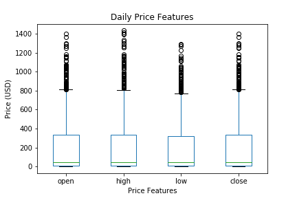
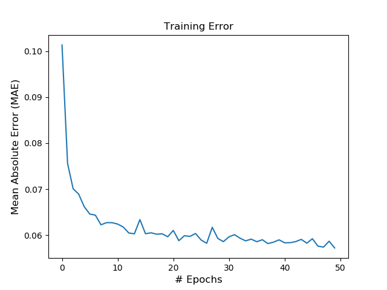

<!-- Use this to comment out a line -->

# Cryptocurrency Prediction

By Ryan Curry 11/16/18

## Introduction

## Question

Is it possible to predict Ethereum's next day closing price using a neural network?

## Data Source

I used [Ethereum's Historical Price Data](https://coinmarketcap.com/currencies/ethereum/) from [CoinMarketCap](https://coinmarketcap.com/). The historical data includes daily price information, volume and market cap.  

Features included in data (daily):
- Date
- Open Price
- High
- Low
- Closing Price
- Volume
- Market Cap

## Exploratory Data Analysis

Figure 1. *df.head()*

  

Figure 2. *(left) dtypes, (right) isnull*

Figure 3. *info*

Figure 4. *describe*

Figure 5. *Ethereum Historical Closing Prices*

Figure 6. *boxplots of daily open, high, low and closing prices*

Figure 7. *Closing Price Histogram*

Figure 8. *Closing Price Kernal Density Estimation (KDE) Plot*

Figure 9. *Closing Price Lag Plot*

The Closing Price Lag Plot in Figure 9 shows the closing prices clustering along a diagonal line from
bottom-left to top-right. This indicates a positive correlation between y(t) and y(t+1).

Figure 10. *Closing Price Lag Scatter Plots from t-1 to t-8*

Looking at the different lag plots in Figure 10, the strongest relationships are closest to t+1.

Figure 11. *Closing Price Autocorrelation Plot*

Autocorrelation plots are a tool for checking randomness in a dataset. This randomness is determined by computing autocorrelations for data values at varying time lags. If random, these autocorrelations should be near zero for any and all time-lag separations. These plots graphically summarize the strength of a relationship with an observation in a time series with observations at prior time steps. The plot shows lag on the x-axis and the correlation on the y-axis.

Figure 12. *Closing Price Autocorrelation for 100 Time Intervals*

Statistical correlation summarizes the strength of the relationship between two variables. Confidence intervals are drawn as a cone. By default, this is set to a 95% confidence interval, suggesting that correlation values outside of this cone are very likely a correlation and not a statistical fluke. (Machine Learning Mastery)

Figure 13. *Pearson Coefficients between Features*

Figure 14. *Correlation Heatmap*

  

Figure 15. *Historical Closing Prices by Year*

  

Figure 16. *Historical Closing Prices by Month*

  

Figure 17. *Random Forest Feature Importances*

  

Figure 18. *Daily Price Change Distribution*

  

Figure 19. *Closing Price with Volume*

## Modeling

### Recurrent Neural Network

"A recurrent neural network (RNN) is a class of artificial neural networks where connections between nodes form a directed graph along a sequence. This allows it to exhibit temporal dynamic behavior for a time sequence. Unlike feedforward neural networks, RNNs can use their internal state (memory) to process sequences of inputs." (Wikipedia)

RNNs are popular because they have the ability to use previous information to help with a current task. A problem with a normal RNN is that in practice, as the gap between the historical information and the new information grows, the RNN struggles to learn to connect the relevant information to that new task. This can be attributed to the architecture of a vanilla RNN. It is basically a loop, that when unraveled, is just a sequence of repeating steps.

Figure 1. *Vanilla RNN*

Figure 2. *Unraveled RNN ([colah's blog](http://colah.github.io/posts/2015-08-Understanding-LSTMs/))*

### LSTM Neural Network

"Long Short Term Memory networks – usually just called “LSTMs” – are a special kind of RNN, capable of learning long-term dependencies." (Colah's Blog)

LSTMs are designed to avoid the long-term dependency problem by using a chain structure with four internal layers to each cell. The different layers include a "forget gate", an "input gate" that works with an "update gate", and an "output gate". These gates work in conjunction with its long term memory, also called the cell state. Then the short term memory is processed and added to as we pass through the chain.

Figure 3. *LSTM Recurrent Neural Network ([colah's blog](http://colah.github.io/posts/2015-08-Understanding-LSTMs/))*

#### LSTM Architectures Used

I used two different LSTM architectures in this project. The first was a single layer LSTM model and the second was a deeper, multi-layer LSTM model.

Single-Layer LSTM Network Architecture:
- (1) sequential model
- (1) LSTM layer
- (30) neurons within that layer
- (1) Dropout of 20%
- (1) Dense output layer
- Linear activation function
- Mean Absolute Error (MAE) as the loss function
- ADAM optimizer

Multi-Layer LSTM Network Architecture:
- (1) sequential model
- (3) LSTM layers
- (30) neurons within each layer
- (2) Dropout layers of 20%
- (1) Dense output layer
- Linear activation function
- Mean Absolute Error (MAE) as the loss function
- ADAM optimizer

#### Training the Network

To train and test these network architectures, I split the data at 2018-03-16, which is approximately an 80/20 split. I used a window length of 10, meaning the network would look at the ten (10) days before the target date and then predict the 11th day's closing price. Then I ran the networks for fifty (50) epochs each to compare the results.

  

Figure 4. *Data Split Point - Train and Test Sets*

## Results

  

Figure 1. *Single Layer LSTM Training Error over 50 Epochs*

  

Figure 2. *Multi-Layer LSTM Training Error over 50 Epochs*

  

Figure 3. *Single Layer LSTM Training Set Prediction*

  

Figure 4. *Multi-Layer LSTM Training Set Prediction*

Looking at figures 3 and 4, the multi-layer LSTM model performed slightly better then the single layer on the training data.

  

Figure 5. *Single Layer LSTM Test Set Prediction*

  

Figure 6. *Multi-Layer LSTM Test Set Prediction*

Looking at figures 5 and 6, the single layer LSTM model performed slightly better then the multi-layer on the test data.

#### Predict the Next 5 Days

I then retrained the same models to use 10 days of data to try to predict the next 5 days of closing prices.

  

Figure 7. *Single Layer LSTM 5-Day Test Set Prediction*

  

Figure 8. *Multi-Layer LSTM 5-Day Test Set Prediction*

Again, the single layer network performed slightly better than the multi-layer network.

## Future Work

- Predicting further into the future with the help of moving averages
- Add other sources of information such as macro-economic factors and blockchain technology factors
- Add social media sources using NLP
- Add media sources such as the WSJ and NYT using NLP
- Expand the analysis to include more cryptocurrencies (model the market)
- Build first iteration of a trading bot  

#### References
- [colah's blog](http://colah.github.io/posts/2015-08-Understanding-LSTMs/)
- [Towards Data Science website](https://towardsdatascience.com/)
- [Machine Learning Mastery](https://machinelearningmastery.com/)
- [Siraj Raval (YouTube)](https://www.youtube.com/watch?v=d4Sn6ny_5LI&t=108s)
- [Jakob Aungier](http://www.jakob-aungiers.com/articles/a/LSTM-Neural-Network-for-Time-Series-Prediction)
- [dashee87.github.io](https://dashee87.github.io/deep%20learning/python/predicting-cryptocurrency-prices-with-deep-learning/)
- [Patrick Triest](https://blog.patricktriest.com/analyzing-cryptocurrencies-python/)
- [CoinMarketCap](https://coinmarketcap.com/currencies/ethereum/historical-data/)
- [The Unreasonable Effectiveness of Recurrent Neural Networks](http://karpathy.github.io/2015/05/21/rnn-effectiveness/)
